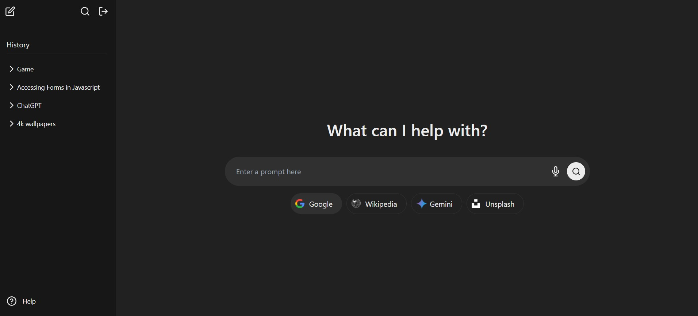

# Bisleri UI Clone

I have created a **multi-engine project** that integrates four different APIs—**Google, Wikipedia, Gemini, and Unsplash**—to provide diverse and rich data sources.  

- **Google API** helps fetch search results and relevant web data.  
- **Wikipedia API** retrieves structured information and summaries from Wikipedia articles.  
- **Gemini API** processes AI-generated responses, primarily in Markdown format.  
- **Unsplash API** provides high-quality images based on search queries.  

This project allows seamless access to multiple data sources, combining web search, knowledge retrieval, AI-generated content, and image fetching in a single platform. 🚀
​
## Challenges I encountered while developing the multi-engine project.

​
- **Tailwind CSS**: I face issues with Tailwind CSS when using media queries because it differs from regular CSS. In normal CSS, we can wrap styles within classes, making it more structured. However, in Tailwind, media query classes must be applied to each individual element, which makes the code harder to read and debug. Additionally, Tailwind provides only predefined ways to write media queries, which feels more restrictive compared to the flexibility of standard CSS, where multiple approaches are available.

- **Gemini API Response**: The Gemini API responds in Markdown format instead of JSON, which was unfamiliar to me and initially difficult to understand. I researched it online, learned about Markdown, and used the `marked.parse()` function to convert the response into HTML for proper rendering.

- **SpeechRecognition**: While working with the **SpeechRecognition** API for voice-to-text conversion, I initially struggled with its implementation and how it interacted with browsers. Additionally, I faced an issue where the microphone wasn't capturing audio properly. At first, I suspected an API or permission-related problem, but after troubleshooting, I realized the website was using the wrong microphone as the default input device. By researching the API’s features, exploring event handlers, and manually selecting the correct mic, I successfully integrated SpeechRecognition and resolved the issue for real-time speech transcription.

## Project Structure

- **HTML**: Structure of the website including the layout, header, footer, and content sections.

- **Tailwind CSS**: Styling for all page elements, ensuring responsiveness and consistency across different devices.

- **JavaScript**: Interactive features such as modals and click events,chat bot, enhancing the user experience.

## Hosted Link

You can view the live version of the Multi Engine at the following link:

https://multi-engine-virid.vercel.app/